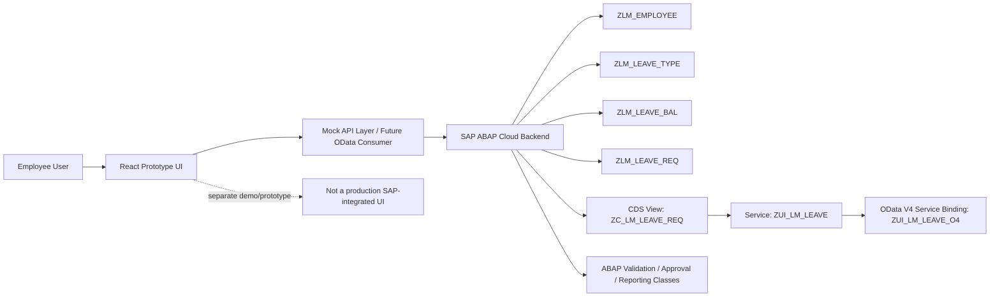
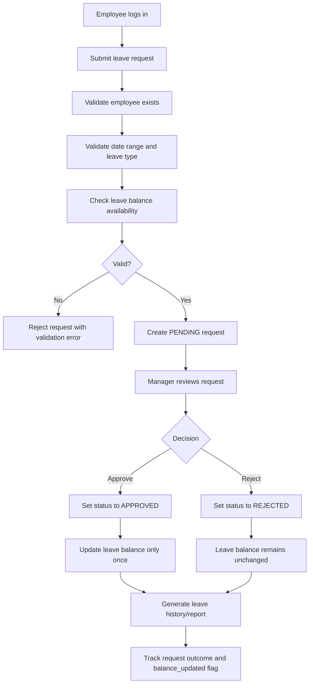
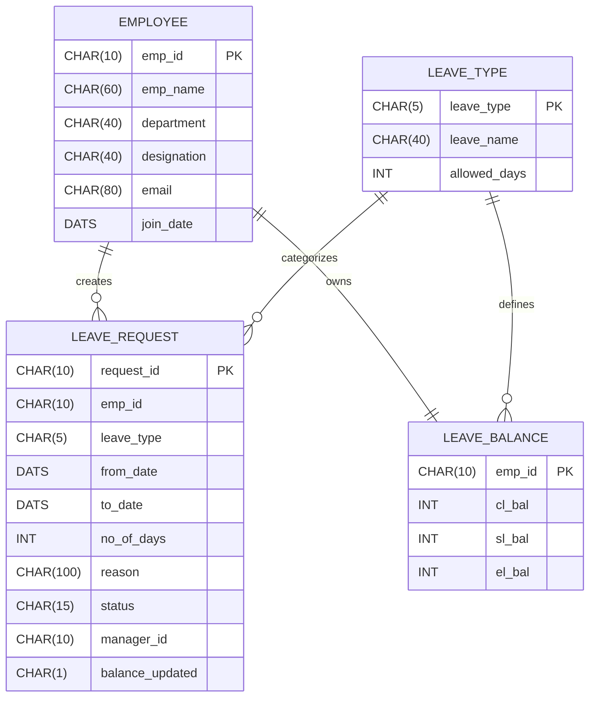

# SAP Leave Management System

A recruiter-ready SAP ABAP Cloud project for employee leave management, focused on the backend business flow, validation logic, and OData exposure. The repository demonstrates a leave approval lifecycle from request creation through validation, manager decision, balance reconciliation, and reporting.

The React application is a separate frontend prototype using mock data for demonstration purposes. It is not integrated as a production SAP frontend and should be treated as a UI showcase rather than a production SAP application.

## Recruiter-friendly project summary

This project showcases a practical SAP ABAP Cloud leave management solution designed for enterprise employee workflows. It models the core business process of employee leave requests, including validation of leave balances, manager approval and rejection, automatic balance updates for approved requests, and reporting on historical leave activity.

The solution emphasizes enterprise-grade fundamentals such as:
- database design using custom ABAP tables
- data validation and business rule enforcement
- approval workflow logic
- CDS exposure and OData V4 service design
- ABAP based business objects and class-based processing

This repository is particularly relevant for SAP backend and ABAP Cloud roles, where strong domain modeling, transactional logic, and service exposure are valued.

## Problem statement

Organizations need a structured way to manage employee leave requests while ensuring consistency, accountability, and business compliance. A manual or inconsistent process often causes:
- leave balance miscalculation
- approval ambiguity
- duplicate deduction risks
- poor visibility into leave history
- limited automation in employee and manager workflows

This system addresses those challenges by creating a clear employee leave lifecycle backed by SAP ABAP Cloud concepts, CDS views, and OData-based service exposure.

## Project overview

The project contains the core SAP backend implementation and a separate React-based UI prototype. The backend is designed around the following business domain:
- employee master data
- leave types and allowed entitlement
- employee-specific leave balances
- leave request lifecycle
- manager decision processing
- leave history reporting

The workflow is intentionally simple and domain-focused so that the repository remains understandable and recruiter-friendly while still demonstrating SAP ABAP development patterns.

## Architecture overview



## Complete leave-management workflow



## Business rules and validation logic

The implemented logic in the ABAP classes matches the actual repository behavior. The major rules are:

1. Employee must exist before a leave request is processed.
2. `From Date` cannot be later than `To Date`.
3. Only supported leave types are accepted (`CL`, `SL`, `EL`).
4. Leave balance must exist for the employee and requested leave type.
5. Requested number of days must not exceed the available balance.
6. Only `PENDING` requests can be approved or rejected.
7. Rejected requests do not reduce the available balance.
8. Only `APPROVED` requests trigger balance deduction.
9. Duplicate balance updates are prevented using the `balance_updated` flag.
10. A request is considered complete only after the manager decision and any relevant balance update is applied.

The validation logic is implemented in `backend/classes/ZCL_LEAVE_VALIDATION.abap`, while approval, rejection, and balance update logic live in:
- `ZCL_LEAVE_APPROVAL.abap`
- `ZCL_LEAVE_REJECTION.abap`
- `ZCL_LEAVE_BALANCE_UPDATE.abap`

## Data model and table relationships

The core persistence model contains four ABAP custom tables.



### Database tables

| Table | Purpose | Key fields |
|---|---|---|
| `zlm_employee` | Stores employee master records | `client`, `emp_id` |
| `zlm_leave_type` | Stores leave master data and entitlement limits | `client`, `leave_type` |
| `zlm_leave_bal` | Stores employee leave balances by type (`cl_bal`, `sl_bal`, `el_bal`) | `client`, `emp_id` |
| `zlm_leave_req` | Stores leave requests, status, and approval lifecycle metadata | `client`, `request_id` |

The repository reflects a strong one-employee-to-many-leave-request relationship, and a one-employee-to-one-balance record in practice.

## ABAP classes and responsibilities

All class files are located under `backend/classes/`.

| Class | Responsibility |
|---|---|
| `ZCL_LEAVE_SAMPLE_DATA` | Inserts starter employee, leave type, and leave balance data into the custom tables |
| `ZCL_LEAVE_VALIDATION` | Verifies employee existence, valid dates, leave type, and sufficient balance before request creation |
| `ZCL_LEAVE_APPROVAL` | Updates a `PENDING` leave request to `APPROVED` |
| `ZCL_LEAVE_REJECTION` | Updates a `PENDING` leave request to `REJECTED` |
| `ZCL_LEAVE_BALANCE_UPDATE` | Applies the leave deduction for an approved request and prevents duplicate balance changes |
| `ZCL_LEAVE_REPORT` | Prints all leave requests in a readable report format for tracking and review |

These classes are implemented as runtime ABAP classes using `if_oo_adt_classrun` and output their results to the console, which is consistent with the repository’s current state and not a full test automation framework.

## CDS view, service definition, and OData V4 service

### CDS view

`backend/cds/ZC_LM_LEAVE_REQ.ddls`

This root view exposes the leave request data from `zlm_leave_req` as a consumption view for service exposure.

```abap
@AccessControl.authorizationCheck: #NOT_REQUIRED
@EndUserText.label: 'Leave Request UI View'
@Metadata.allowExtensions: true
define root view entity ZC_LM_LEAVE_REQ
  as select from zlm_leave_req
{
  key request_id      as RequestId,
      emp_id           as EmpId,
      leave_type       as LeaveType,
      from_date        as FromDate,
      to_date          as ToDate,
      no_of_days       as NoOfDays,
      reason           as Reason,
      status           as Status,
      manager_id       as ManagerId,
      balance_updated  as BalanceUpdated
}
```

### Service definition

`backend/services/ZUI_LM_LEAVE.ddls`

```abap
@EndUserText.label: 'Leave Management UI Service'
define service ZUI_LM_LEAVE {
  expose ZC_LM_LEAVE_REQ as LeaveRequests;
}
```

This exposes the leave request CDS view as the `LeaveRequests` entity set.

### OData V4 service binding

`backend/services/ZUI_LM_LEAVE_O4.txt`

The repository documents the service binding as:
- Service Binding: `ZUI_LM_LEAVE_O4`
- Service Definition: `ZUI_LM_LEAVE`
- Entity Set: `LeaveRequests`
- CDS View: `ZC_LM_LEAVE_REQ`

This is the public integration layer expected to be consumed by external apps, including future UI clients.

## Technology stack

### SAP and backend
- SAP ABAP Cloud
- ABAP Object-Oriented Programming
- CDS (Core Data Services)
- OData V4
- SAP BTP style application architecture
- ABAP Development Tools (ADT)

### Frontend prototype
- React 18
- Vite
- JavaScript / JSX
- React Router
- Express server for demo / integration stub

### Project characteristics
- Domain-driven design around leave management
- Transactional business flow logic in ABAP classes
- Read-friendly repository structure for portfolio presentation
- UI prototype separated from SAP backend for clarity and accuracy

## Repository structure

```text
sap-leave-management-system/
├── README.md                         # Main project overview and recruiter-facing documentation
├── SECURITY.md                      # Security policy and secret handling guidance
├── .gitignore                       # Repository-wide ignore rules
├── backend/
│   ├── README.md                    # Backend-focused documentation
│   ├── cds/
│   │   └── ZC_LM_LEAVE_REQ.ddls     # CDS view for leave requests
│   ├── classes/
│   │   ├── ZCL_LEAVE_SAMPLE_DATA.abap
│   │   ├── ZCL_LEAVE_VALIDATION.abap
│   │   ├── ZCL_LEAVE_APPROVAL.abap
│   │   ├── ZCL_LEAVE_REJECTION.abap
│   │   ├── ZCL_LEAVE_BALANCE_UPDATE.abap
│   │   └── ZCL_LEAVE_REPORT.abap
│   ├── services/
│   │   ├── ZUI_LM_LEAVE.ddls
│   │   └── ZUI_LM_LEAVE_O4.txt
│   └── tables/
│       ├── ZLM_EMPLOYEE.ddls
│       ├── ZLM_LEAVE_TYPE.ddls
│       ├── ZLM_LEAVE_BAL.ddls
│       └── ZLM_LEAVE_REQ.ddls
├── frontend/
│   ├── README.md                    # Prototype documentation only
│   ├── .env.example                 # Safe sample configuration
│   ├── .env                         # Secrets removed; placeholders only
│   ├── .gitignore
│   ├── package.json
│   ├── server/
│   └── src/
│       ├── App.jsx
│       ├── config.js
│       ├── data/
│       ├── pages/
│       ├── services/
│       └── utils/
├── docs/
│   └── SAP_Leave_Management_Backend_Project.pdf
└── README.md
```

## Testing and results documentation

This repository does not currently include a formal automated test suite such as ABAP ATC tests, unit test classes, or frontend test scripts. The actual validation artifacts in code are runtime demonstration classes that execute logic and print the result to the console.

The repository therefore demonstrates test and validation behavior through the following evidence:
- `ZCL_LEAVE_VALIDATION.abap` logs validation errors for invalid employees, invalid date ranges, and insufficient leave balances.
- `ZCL_LEAVE_APPROVAL.abap` confirms `PENDING` requests become `APPROVED`.
- `ZCL_LEAVE_REJECTION.abap` confirms `PENDING` requests become `REJECTED`.
- `ZCL_LEAVE_BALANCE_UPDATE.abap` confirms balance is reduced only for approved requests and prevents duplicates.
- `ZCL_LEAVE_REPORT.abap` prints a leave history report for review.

These are functional validation scripts rather than a production testing framework. The repository should be presented as a working business-process proof-of-concept rather than a full enterprise QA suite.

## Screenshots and mockups

Actual application screenshots are not present in the repository. The following placeholders maintain professionalism and clarity for portfolio presentation.

- Screenshot placeholder: Employee dashboard — to be captured in a live SAP or prototype environment
- Screenshot placeholder: Manager approval screen — to be captured in a live SAP or prototype environment
- Screenshot placeholder: Leave balance summary — to be captured in a live SAP or prototype environment
- Screenshot placeholder: Leave history/report screen — to be captured in a live SAP or prototype environment

## Future enhancements

This project has a clear roadmap for real-world scaling:
- implement full RAP-based business object with write operations
- add manager hierarchy and escalation rules
- extend leave types with policy-based rules and public holidays
- introduce notifications and approval email reminders
- add role-based access using SAP IAS / XSUAA
- expose additional OData entities for employee, balance, and leave types
- add search, filter, and pagination for leave requests
- integrate with SAP Fiori or a modern UI framework when the SAP service is production-ready

## Security considerations

This repository must never commit credentials, service keys, tokens, or SAP client secrets. The project is intentionally focused on SAP backend logic and should keep all runtime secrets in environment variables or a secure SAP BTP configuration store.

The repository previously included credential material in `frontend/.env`. Those values were sanitized and replaced with placeholders before finalizing this documentation update.

See `SECURITY.md` for the full policy.

## Professional conclusion

This project demonstrates practical SAP ABAP Cloud thinking, including core enterprise workflow design, data modeling, validation, service exposure, and workflow automation. It is especially suited for a SAP backend, ABAP Cloud, or enterprise application developer profile.

It is strongest as a backend-first business process project, with the front-end treated as a separate demonstration layer rather than a production SAP application.

## How to use this repository

1. Review the ABAP tables in `backend/tables/`.
2. Study the validation and approval logic in `backend/classes/`.
3. Inspect the CDS/OData exposure under `backend/cds/` and `backend/services/`.
4. Review the prototype UI under `frontend/` as a demonstration only.
5. Treat the backend as the main project and the React UI as a separate mock workflow prototype.

## Notes for ATS and recruiter review

- Core domain: employee leave management with SAP ABAP Cloud
- Primary backend technology: ABAP, CDS, OData V4
- Supporting prototype: React + Vite UI
- Business logic: approval workflow, validation, balance management, reporting
- Portfolio value: strong enterprise workflow representation with clear business process understanding
- Important nuance: frontend is not production-integrated SAP; it is a separate prototype for presentation and demo use

This repository is best positioned as a SAP backend-focused project demonstrating workflow design, data modeling, and business logic in ABAP Cloud.

---

This repository was prepared for professional portfolio presentation and technical accuracy. It avoids overstating frontend integration and keeps the SAP backend as the primary project.
