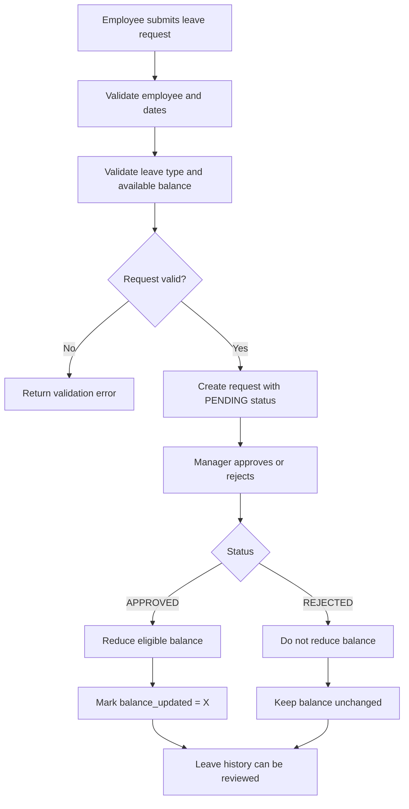

# SAP Leave Management System - Backend

This folder contains the core SAP ABAP Cloud backend for the leave management solution. It focuses on the actual business domain, business rules, and data exposure behind the leave workflow.

The backend is the primary project in this repository. The React frontend in the parent folder is a separate prototype used for demonstration and mock user experience, not a production SAP-integrated application.

## Purpose

The backend models the employee leave lifecycle and covers the following areas:
- employee master data management
- leave type and entitlement definition
- leave balance tracking
- leave request creation and validation
- manager approval and rejection
- balance deductions for approved requests
- leave history reporting
- CDS and OData exposure for external consumers

## Technology stack

- SAP ABAP Cloud
- ABAP Object-Oriented Programming
- CDS (Core Data Services)
- OData V4
- SAP ADT / Eclipse-based ABAP tooling

## Table design and relationships

The implemented data model is centered around the following tables:

- `zlm_employee` — employee master data
- `zlm_leave_type` — leave type catalog
- `zlm_leave_bal` — employee leave balance summary
- `zlm_leave_req` — leave request transaction data

Relationship summary:
- One employee can submit many leave requests.
- One employee has one leave balance record for the leave-balance summary.
- One leave type belongs to many requests and is used for balance validation.
- Each leave request references employee, leave type, decision state, and manager metadata.

## Tables

### `ZLM_EMPLOYEE`
Purpose: stores employee details.

Fields include:
- `emp_id`
- `emp_name`
- `department`
- `designation`
- `email`
- `join_date`

### `ZLM_LEAVE_TYPE`
Purpose: stores available leave categories and entitlement ceilings.

Fields include:
- `leave_type`
- `leave_name`
- `allowed_days`

### `ZLM_LEAVE_BAL`
Purpose: stores employee-specific available balances by leave category.

Fields include:
- `emp_id`
- `cl_bal`
- `sl_bal`
- `el_bal`

### `ZLM_LEAVE_REQ`
Purpose: stores each leave request and its approval status.

Fields include:
- `request_id`
- `emp_id`
- `leave_type`
- `from_date`
- `to_date`
- `no_of_days`
- `reason`
- `status`
- `manager_id`
- `balance_updated`

## Business flow



## Business rules implemented in code

The repository reflects these rules in the ABAP class logic:

1. The employee must exist before any request process is allowed.
2. Date validation must ensure `from_date <= to_date`.
3. `leave_type` must be a valid type in the domain.
4. A leave balance row must exist for the employee and relevant leave category.
5. Requested days must not exceed the available balance.
6. Only `PENDING` requests can be approved or rejected.
7. Rejected requests do not impact leave balances.
8. Approved requests can only update the balance once.
9. `balance_updated = 'X'` protects against duplicate deduction.

## ABAP classes and responsibilities

| Class | File | Responsibility |
|---|---|---|
| `ZCL_LEAVE_SAMPLE_DATA` | `backend/classes/ZCL_LEAVE_SAMPLE_DATA.abap` | Seeds employee, leave type, and balance data |
| `ZCL_LEAVE_VALIDATION` | `backend/classes/ZCL_LEAVE_VALIDATION.abap` | Performs validation before request creation |
| `ZCL_LEAVE_APPROVAL` | `backend/classes/ZCL_LEAVE_APPROVAL.abap` | Converts a leave request from `PENDING` to `APPROVED` |
| `ZCL_LEAVE_REJECTION` | `backend/classes/ZCL_LEAVE_REJECTION.abap` | Converts a leave request from `PENDING` to `REJECTED` |
| `ZCL_LEAVE_BALANCE_UPDATE` | `backend/classes/ZCL_LEAVE_BALANCE_UPDATE.abap` | Deducts approved request days from the employee balance and prevents duplicate deduction |
| `ZCL_LEAVE_REPORT` | `backend/classes/ZCL_LEAVE_REPORT.abap` | Prints leave history for review |

These classes are implemented using `if_oo_adt_classrun` and output results via console messages, which matches the repository’s current structure.

## CDS and OData exposure

### CDS view

`backend/cds/ZC_LM_LEAVE_REQ.ddls`

This view reads from `zlm_leave_req` and exposes the request data to the service layer.

### Service definition

`backend/services/ZUI_LM_LEAVE.ddls`

```abap
@EndUserText.label: 'Leave Management UI Service'
define service ZUI_LM_LEAVE {
  expose ZC_LM_LEAVE_REQ as LeaveRequests;
}
```

### OData V4 binding

`backend/services/ZUI_LM_LEAVE_O4.txt`

This defines the OData V4 service binding:
- Service Binding: `ZUI_LM_LEAVE_O4`
- Service Definition: `ZUI_LM_LEAVE`
- Entity Set: `LeaveRequests`
- CDS View: `ZC_LM_LEAVE_REQ`

## File structure

```text
backend/
├── README.md
├── cds/
│   └── ZC_LM_LEAVE_REQ.ddls
├── classes/
│   ├── ZCL_LEAVE_SAMPLE_DATA.abap
│   ├── ZCL_LEAVE_VALIDATION.abap
│   ├── ZCL_LEAVE_APPROVAL.abap
│   ├── ZCL_LEAVE_REJECTION.abap
│   ├── ZCL_LEAVE_BALANCE_UPDATE.abap
│   └── ZCL_LEAVE_REPORT.abap
├── services/
│   ├── ZUI_LM_LEAVE.ddls
│   └── ZUI_LM_LEAVE_O4.txt
└── tables/
    ├── ZLM_EMPLOYEE.ddls
    ├── ZLM_LEAVE_TYPE.ddls
    ├── ZLM_LEAVE_BAL.ddls
    └── ZLM_LEAVE_REQ.ddls
```

## Validation and results

The repository currently contains validation and workflow demonstrations rather than a formal automated test suite. The meaningful verification is driven by the runtime class logic:

- invalid employee detection
- invalid date range detection
- insufficient balance checks
- approval and rejection transitions
- balance update safety checks
- leave request reporting outputs

This is a practical ABAP-side business validation solution suitable for a SAP backend project portfolio.

## Security note

This backend should never include credentials or service keys in source code. All real secrets must be handled through secure SAP BTP configuration and environment variables only.

## Summary

This backend demonstrates a complete, business-focused SAP ABAP leave management scenario with domain modeling, transaction logic, validation, balance management, and OData exposure. It is suitable for SAP backend and enterprise domain resume positioning while remaining honest about the status of the frontend prototype.
